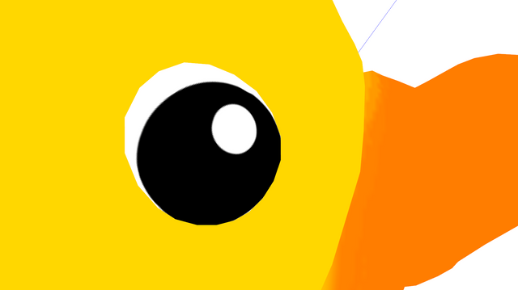

# Sandbox
Sandbox is 3D game engine. It's my first experience in computer graphics so far.

## Features
* Loading gltf2 models using tinygltf
* Building a scene with models
* Rendering using OpenGL
* PBR/IBL rendering
* Module architecture

## Build
Project can be built using CMake. Compiler must support c++ 17.
Only tested on Windows so far.

## Screenshots
* [Link](https://sketchfab.com/3d-models/material-ball-in-3d-coat-a6bdf1d11d714e07b9dd99dda02de965) to original model.  

* [Link](https://sketchfab.com/3d-models/kv-2-heavy-tank-1940-ba8b84d78c0a42038cf2eaa4210ef296) to original model.    
  

* [Link](https://github.com/KhronosGroup/glTF-Sample-Models/tree/master/2.0/SciFiHelmet) to original model.  

